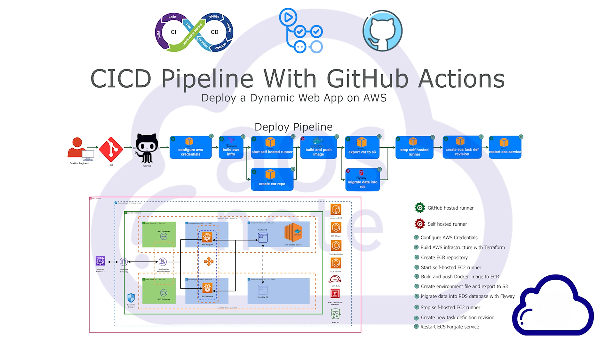
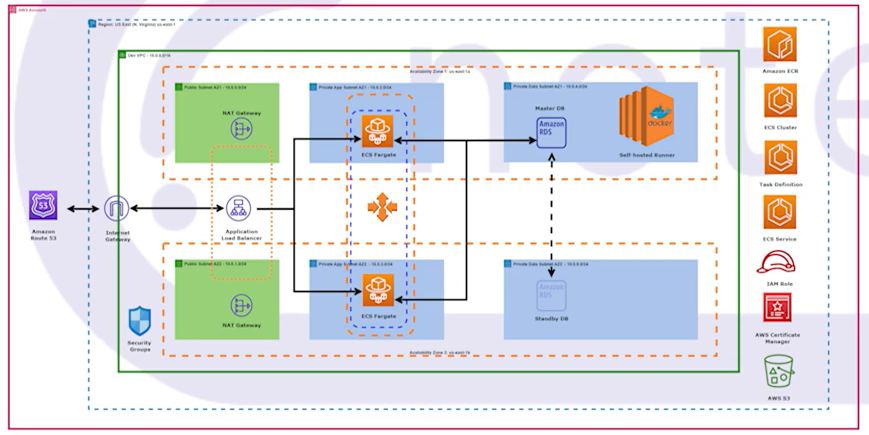

# Deploy a Dynamic Web App on AWS using CI/CD Pipelines with GitHub Actions

---
# Project Overview

This project demonstrates the deployment of a dynamic web application on AWS using CI/CD pipelines and GitHub Actions. The infrastructure is provisioned using Terraform, and the application is containerized with Docker. The deployment utilizes AWS services like ECR (Elastic Container Registry), EC2 (Elastic Compute Cloud), S3 (Simple Storage Service), RDS (Relational Database Service), and ECS Fargate for seamless scaling and deployment.

## Project Workflow

The following steps describe how AWS services are configured and how the CI/CD pipeline is set up to automate the deployment of the dynamic web application.

---

## Steps

### 1. Configure AWS Credentials

To interact with AWS services, I needed to configure your AWS credentials. These will be used by GitHub Actions to interact with AWS services securely.

---

### 2. Build AWS Infrastructure with Terraform

Used Terraform to manage and provision the necessary AWS resources, including EC2 instances, S3 buckets, ECR repositories, RDS, and ECS clusters. This will provision the infrastructure resources on AWS.

---

### 3. Create an ECR Repository

An Amazon Elastic Container Registry (ECR) repository is used to store the Docker images for the dynamic web application.

---

### 4. Start a Self-hosted EC2 Runner

For running the CI/CD pipeline with GitHub Actions, I'll need a self-hosted EC2 runner.

---

### 5. Build and Push Docker Image to ECR

GitHub Actions will automate the process of building and pushing the Docker image to the ECR repository.

---

### 6. Create an Environment File and Export to S3

An environment file containing necessary configurations (database URL, credentials) is created and uploaded to an S3 bucket.

---

### 7. Migrate Data into the RDS Database with Flyway

Flyway will handle database migrations to ensure the RDS database schema is up to date.

---

### 8. Stop the Self-hosted EC2 Runner

Once the CI/CD pipeline completes, I stopped the self-hosted EC2 runner to save resources.

---

### 9. Create a New Task Definition Revision

After the Docker image is pushed to ECR, I created a new task definition revision in ECS.

---

### 10. Restart the EC2 Fargate Service

Forced a new deployment by restarting the ECS Fargate service using the updated task definition.

---

### Dynamic Web Application Deployment

## Conclusion

In this project, I successfully deployed a dynamic web application on AWS with a fully automated CI/CD pipeline using GitHub Actions. Terraform managed the infrastructure, Docker handled the application containerization, and AWS services such as ECR, EC2, RDS, S3, and ECS Fargate ensured scalability and reliability.

